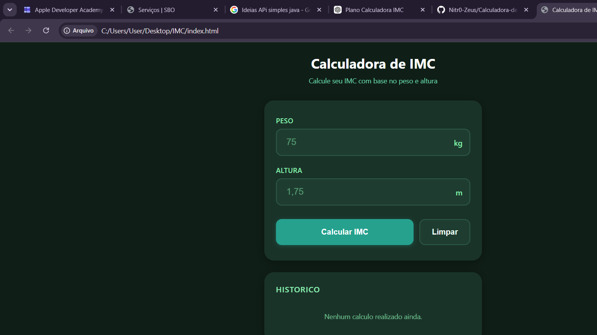
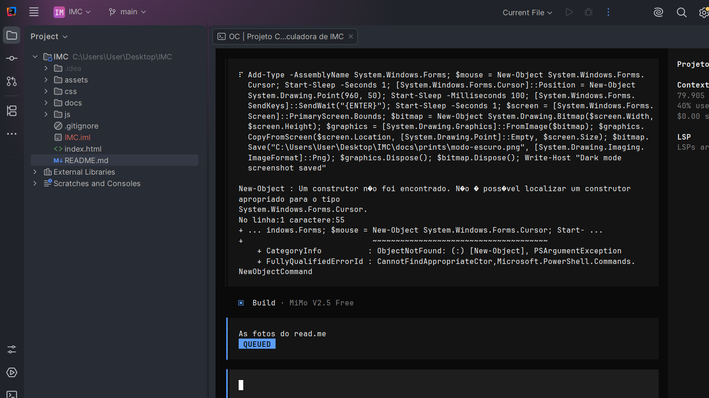

# Calculadora de IMC

Aplicacao web para calculo do Indice de Massa Corporal (IMC) com base no peso e altura informados pelo usuario.

---

## Funcionalidades

- Calculo do IMC usando a formula oficial: `IMC = Peso / (Altura x Altura)`
- Classificacao do resultado conforme tabela do Ministerio da Saude
- Historico dos ultimos 10 calculos realizados
- Modo claro e modo escuro
- Validacao de entrada de dados
- Interface responsiva para desktop e mobile

---

## Estrutura do Projeto

```
IMC/
├── index.html          # Pagina principal
├── css/
│   └── style.css       # Estilos e temas
├── js/
│   └── calculadora.js  # Logica da aplicacao
├── docs/               # Documentacao e prints
└── README.md           # Este arquivo
```

---

## Como Utilizar

### 1. Abrir a Aplicacao

Abra o arquivo `index.html` em qualquer navegador moderno (Chrome, Firefox, Edge, Safari).

### 2. Informar os Dados

**Peso:**
- Digite o peso em quilogramas (kg)
- Aceita virgula ou ponto como separador decimal
- Exemplos: `75`, `75,5`, `75.5`

**Altura:**
- Digite a altura em metros ou centimetros
- Se o valor for maior que 10, sera convertido automaticamente de centimetros para metros
- Aceita virgula ou ponto como separador decimal
- Exemplos: `1,75` (metros) ou `175` (centimetros)

### 3. Calcular

Clique no botao **Calcular IMC** ou pressione **Enter** em qualquer campo.

### 4. Ver Resultado

O resultado exibe:
- Valor numerico do IMC
- Classificacao (Abaixo do peso, Peso normal, Sobrepeso, Obesidade grau I/II/III)
- Indicador visual na barra de classificacao

### 5. Limpar

Clique no botao **Limpar** para apagar os campos e o resultado.

### 6. Alternar Tema

Clique no botao no canto superior direito para alternar entre modo claro e escuro.

---

## Classificacao do IMC

| IMC | Classificacao |
|-----|---------------|
| Menor que 18,5 | Abaixo do peso |
| 18,5 a 24,9 | Peso normal |
| 25,0 a 29,9 | Sobrepeso |
| 30,0 a 34,9 | Obesidade grau I |
| 35,0 a 39,9 | Obesidade grau II |
| 40,0 ou mais | Obesidade grau III |

**Nota:** Esta ferramenta e apenas para fins de referencia. Nao substitui orientacao medica profissional.

---

## Validacao de Entrada

O sistema rejeita:

- Campos vazios
- Peso ou altura igual a zero
- Valores negativos
- Letras ou caracteres nao numericos
- Peso acima de 500 kg
- Altura acima de 3 metros

Mensagens de erro sao exibidas na tela quando os dados sao invalidos.

---

## Historico

Os calculos realizados sao salvos automaticamente no navegador (localStorage). Sao mantidos os ultimos 10 registros. O historico persiste mesmo apos fechar e reabrir o navegador.

---

## Tecnologias

- HTML5
- CSS3 (variaveis CSS, flexbox, animacoes)
- JavaScript (vanilla, sem dependencias externas)
- localStorage para persistencia local

---

## Compatibilidade

- Google Chrome 80+
- Mozilla Firefox 75+
- Microsoft Edge 80+
- Safari 13+

---

## Prints da Aplicacao

### Modo Claro



### Modo Escuro



---

## Licenca

Este projeto e de uso livre para fins educacionais e pessoais.
